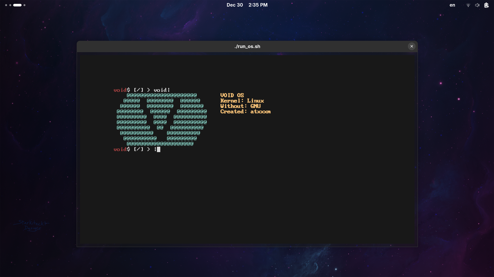

# VoidOS



## Description

**VoidOS** is an experimental Linux kernel-based operating system fully independent of GNU components. The project combines modern OS development approaches, leveraging the Rust and C programming languages to achieve high security and performance.

The primary goal is to create a minimalist environment free from GNU dependencies, serving as a foundation for operating system experimentation.

## Features

- **Linux kernel**: Provides stability and hardware compatibility.
- **GNU-free**: Completely avoids GNU utilities (e.g., coreutils, glibc), opting instead for alternatives such as musl libc.
- **Programming languages**:
  - Rust — for memory-safe development.
  - C — for low-level components.
  - Built using CMake.
- **Project structure**:
  - `dev/` — development tools and build scripts.
  - `os/` — core operating system code and launch script.
  - `void-build/` — VoidOS builder.

## Requirements

To build and run the project, you'll need:
- Rust (rustc and cargo).
- A C compiler (gcc or clang).
- CMake.
- QEMU — for emulation.

## Building and Running

1. Clone the repository:
   ```bash
   git clone https://github.com/atxxxm/VoidOS.git
   ```

2. Navigate to the project directory:
   ```bash
   cd VoidOS
   ```

3. Build the project using the builder:
   ```bash
   cd void-build
   cargo build --release
   cargo run
   ```
   > **Note**: This process automatically builds all required software.

4. To run the OS:
   - Go to the `os/` directory.
   - Make the launch script executable (if needed):
     ```bash
     chmod +x run_void.sh
     ```
   - Launch the OS:
     ```bash
     ./run_void.sh
     ```

**Warning**: This project is experimental and in an early stage of development. Building and running may require additional configuration. If issues arise, check logs and update dependencies.

## Usage

After a successful build, VoidOS can be run in an emulator (QEMU) or—cautiously—on real hardware. At this stage, its main purpose is code exploration and contribution to development.

## Contributing

Contributions of any kind are welcome! To contribute:

1. Fork the repository.
2. Create a feature branch:
   ```bash
   git checkout -b feature/new-feature
   ```
3. Commit your changes:
   ```bash
   git commit -m 'Add new feature'
   ```
4. Push to your fork:
   ```bash
   git push origin feature/new-feature
   ```
5. Open a Pull Request on GitHub.

Please follow the existing code style (Rust and C standards) and include tests whenever possible.